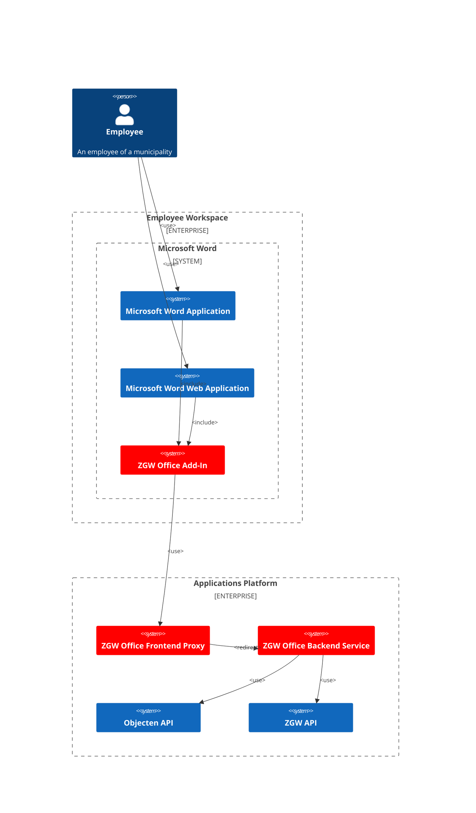

# Architectuur

## C4 Context Diagram

The context diagram shows the system under consideration as a single block, together with all external systems that interact with it. The diagram provides a high-level view of the system and its environment, and is typically used to communicate the system's boundaries and scope.

