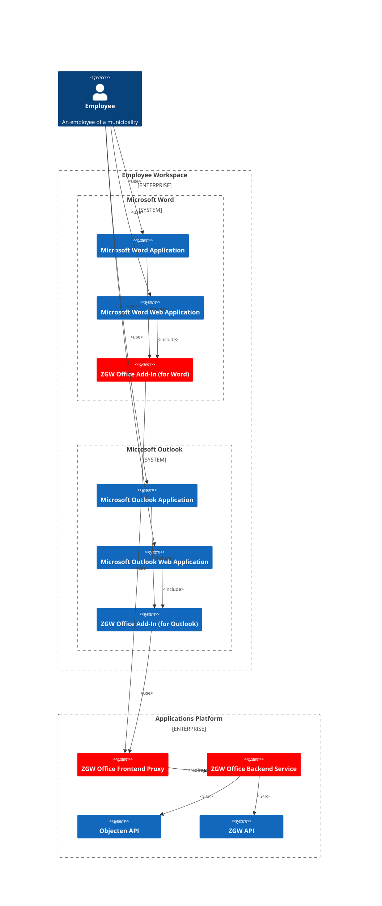

# Architectuur

## Description

The ZGW Office Add-In system enables employees of municipalities to interact with the ZGW (Zaakgericht Werken) system
directly from Microsoft Word and Outlook applications. The add-in is available for both the desktop and web versions
of these applications, allowing users to add documents to a zaak without leaving their familiar work environment.

## C4 Context Diagram

The context diagram shows the system under consideration as a single block, together with all external systems that 
interact with it. The diagram provides a high-level view of the system and its environment, and is typically used to 
communicate the system's boundaries and scope.

