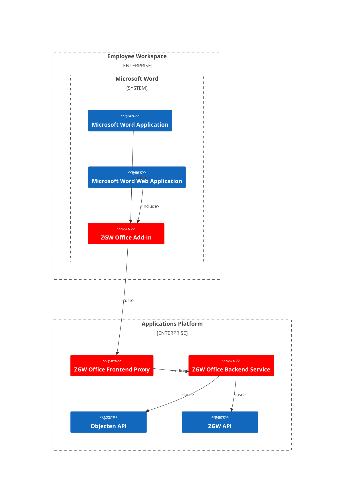

# Beheerdershandleiding ZGW Office Add-In
| versie | datum      | wijziging                                                      |
|--------|------------|----------------------------------------------------------------|
| 0.1    | 2025-07-07 | Opzet van deze beheerdershandleiding in de context van MS Word |

## Inleiding
Deze beheerdershandleiding is bedoeld voor systeembeheerders van gemeenten die de ZGW Office Add-In beheren. De 
add-in is een hulpmiddel dat de integratie van Microsoft Office applicaties met een zaaksysteem gebaseerd op de ZGW 
APIs mogelijk maakt.

## Uitgangssituatie
De uitgangssituatie waar deze handleiding op is gebaseerd, is dat de systeembeheerder werkt met Microsoft 365 Office 
voor een gemeente die de ZGW Office Add-In heeft geïnstalleerd op een omgeving die toegankelijk is voor de medewerkers 
van de gemeente.

Om deze uitgangssituatie te bereiken, is het noodzakelijk dat de ZGW Office Add-In componenten geïnstalleerd en 
geconfigureerd zijn op het Applications Platform van de gemeente. Zie voor meer informatie de 
[Installatie van de ZGW Office Add-In componenten](./platform-installation-manual.md) documentatie.

### Overzicht van de ZGW Office Add-In componenten
De ZGW Office Add-In bestaat uit verschillende componenten die samenwerken om de integratie tussen Microsoft Word en de
ZGW APIs mogelijk te maken. Hieronder [C4 Context Diagram](https://c4model.com/diagrams/system-context) met de 
belangrijkste componenten:

#### Componenten van de ZGW Office Add-In
De componenten van de ZGW Office Add-In zijn rood gemarkeerd in het diagram. Hieronder een overzicht van wat deze 
componenten doen en hoe ze samenwerken.

##### ZGW Office Add-In
De ZGW Office Add-In is de add-in die geïnstalleerd is in de Microsoft Word desktop en webversie. Deze add-in is 
beschikbaar voor installatie vanuit de ZGW Office Frontend Proxy via een **metadata.xml** bestand. Dit bestand bevat de
informatie over de add-in, zoals de naam, beschrijving, versie en de URL's voor de installatie en updates. De verdere 
add-in bestanden worden met de installatie opgehaald vanuit dezelfde ZGW Office Frontend Proxy.

##### ZGW Office Frontend Proxy
De ZGW Office Frontend Proxy is een proxy service die de communicatie tussen de ZGW Office Add-In en de ZGW Office 
Backend Service mogelijk maakt. Deze proxy service is verantwoordelijk voor het doorsturen en valideren van de verzoeken 
van de add-in.

Ook is deze proxy service verantwoordelijk voor het aanbieden van de add-in metadata en de add-in bestanden voor 
installatie in de Microsoft Office applicaties.

##### ZGW Office Backend Service
De ZGW Office Backend Service is de backend service die de communicatie met de ZGW APIs mogelijk maakt. Deze service is
verantwoordelijk voor verdere koppelingen binnen het Applications Platform waarin de ZGW APIs en Objecten API draaien.

## Installatie van de ZGW Office Add-In
De ZGW Office Add-In kan geïnstalleerd worden door de **metadata.xml** te uploaden naar de Microsoft 365 Admin Center. 
Daarna kan de add-in worden geconfigureerd voor gebruikt door de medewerkers van de gemeente.

NB: De installatie en configuratie van de ZGW Office Add-In is een taak voor de systeembeheerder van de gemeente en valt
buiten de scope van deze handleiding.
