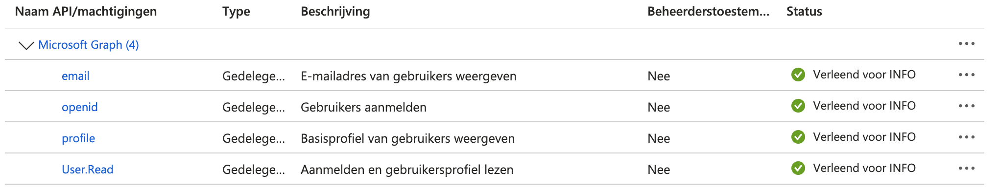

# Azure Registration Manual ZGW Office Add-In

## Introduction
This user guide is intended for the administrators of the Azure environment of the respective municipality.
This guide will describe how the add-in can be registered within the Azure environment.

## The Manual
To register a add-in within your azure environment you can follow the official manual of microsoft [here](https://learn.microsoft.com/en-us/office/dev/add-ins/develop/register-sso-add-in-aad-v2). Using this manual there are a few inputs that which can be filled in like the following

## Register the add-in with Microsoft identity platform
The name of the add-in is "zgw-office-add-in".

The redirect URI can be the following.

## Expose a web API
The application ID URI is "api//zgw-office-addin-dev-frontend.dimpact.lifely.nl/<client_id>".
Replace client_id with your own generated client_id.

Just like the manual says in the Client ID enter "ea5a67f6-b6f3-4338-b240-c655ddc3cc8e".

## Add Microsoft Graph permissions
Select the following permissions
