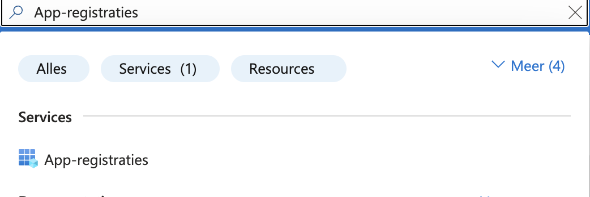
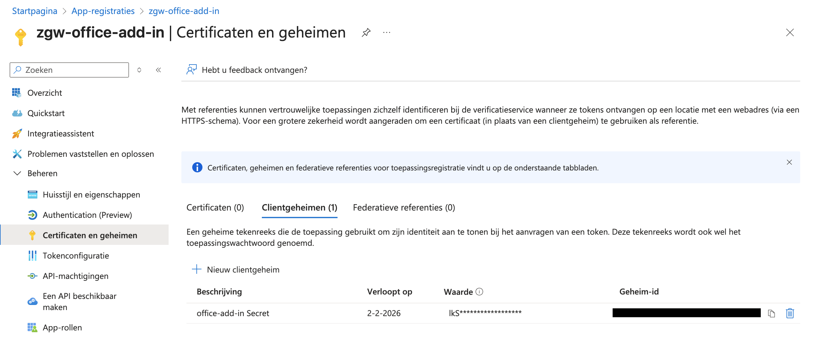
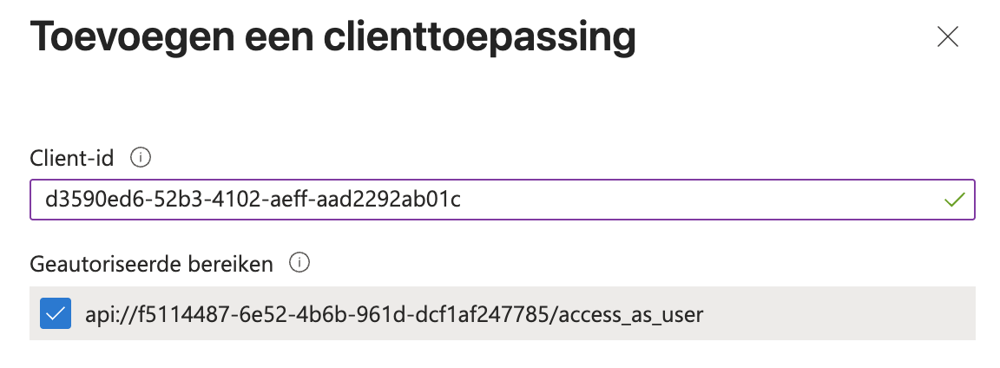

# Azure Registratie handleiding ZGW Office Add-In

## Inleiding
Deze gebruikershandleiding is bedoeld voor de beheerders van de azure omgeving van de desbetreffende gemeente. 
In deze handleiding zal beschreven worden hoe de add-in geregistreerd kan worden binnen de azure omgeving.

## Vereisten
Je bent ingelogd op de [Azure Omgeving](https://portal.azure.com/).
Wanneer je geen beheerder bent van de omgeving zal de beheerder/admin je de rechten moeten geven 
om een add-in te kunnen registreren en de lijst te zien van registreerde add-in's

## Het registreren van de ZGW Office Add-In

### De app registreren
1. Selecteer **App registraties**. Je kunt hier naar navigeren door in de zoekbalk op "App-registraties" te zoeken

3. Klik op nieuwe registratie
4. De registreer een applicatie pagina verschijnt
5. Selecteer en voer het volgende in

6. Klik op Registreren en er verschijnt een bericht dat de applicatie registratie geslaagd is
7. Kopieer de waardes van Toepassings-id (client-id) en Map-id (tenant-id). Deze worden in latere procedures gebruikt

### Clientgeheim toevoegen

Soms een **toepassingswachtwoord** genoemd, is een *clientgeheim* een tekenreeks die je app kan gebruiken in plaats van een certificaat om zichzelf te identificeren.

1. Selecteer in het linkerpaneel **Certificaten en geheimen**.
2. Ga naar het tabblad **Clientgeheimen** en selecteer **Nieuw clientgeheim**.
3. Voeg een nieuw clientgeheim in

4. Voer het volgende in:
   - **Beschrijving**: geef een duidelijke naam voor je geheim.
   - **Vervaldatum**: kies de aanbevolen vervaldatum van 6 maanden

5. Selecteer **Toevoegen**. Er is een nieuw geheim aangemaakt

> Het nieuwe geheim wordt nu aangemaakt en de **waarde wordt tijdelijk weergegeven**.  
> 💡 **Kopieer deze waarde direct**, want je kunt deze later niet meer bekijken.

### Een web-API beschikbaar maken

1. Selecteer in het linkerpaneel **Een API beschikbaar maken** (*Expose an API*).
2. Het venster **Een API beschikbaar maken** verschijnt.
3. Selecteer bovenaan de pagina **Toevoegen** om een toepassings-ID URI te genereren.

### Een bereik toevoegen

1. Ga op de pagina **Een API beschikbaar maken** naar **Een bereik toevoegen**.
2. Het venster **Toevoeg een bereik** opent zich.
3. Voer het bereik als volgende in

4. Stel de **Status** in op **Ingeschakeld** en selecteer **Bereik toevoegen**.

>  De domeinnaam in de Scope-naam (onder het tekstveld) moet automatisch overeenkomen met de eerder ingestelde **Application ID URI**, met `/access_as_user` eraan toegevoegd.  
> Bijvoorbeeld:  
> `api://c6c1f32b-5e55-4997-881a-753cc1d563b7/access_as_user`

### Een clienttoepassing toevoegen (Add a client application)

1. Selecteer **Clienttoepassing toevoegen**.

2. Het venster **Clienttoepassing toevoegen** opent zich.

3. Er moeten 2 Client-id's aangemaakt worden met de volgende Client-id's
   - 93d53678-613d-4013-afc1-62e9e444a0a5
   - d3590ed6-52b3-4102-aeff-aad2292ab01c
  

4. Selecteer onder **Geautoriseerde scopes** (*Authorized scopes*) het vakje bij:
api://<app-id>/access_as_user

5. Selecteer **Toepassing toevoegen**.

De toegevoegde clienttoepassing verschijnt nu in het overzicht van geautoriseerde toepassingen.

### Microsoft Machtigingen
**Let op!** De enige machtiging die de add-in nodig heeft is **User.Read**. Deze staat al standaard in de lijst van machtigingen.
Er hoeft dus geen extra machtiging toegevoegd te worden

### Stel de versie van het toegangstoken in

1. Selecteer in het linkermenu **Manifest**.

2. Zoek in het JSON-bestand naar de eigenschap `requestedAccessTokenVersion` (deze bevindt zich binnen het `api`-object) en stel deze in op de waarde `2`.

3. Sla het bestand op

De app registratie voor de add-in is compleet!

