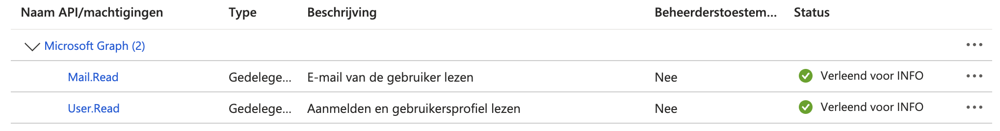

# Azure Registration Manual ZGW Office Add-In

## Introduction

This guide is intended for administrators of the Azure environment of the respective municipality.
It describes how the ZGW Office Add-in can be registered within the Azure environment and made available to users.

Before starting, make sure that:
- The municipality has registered with Dimpact Beheer and has a ticket number.
- The Azure administrator has the necessary administrator rights within the tenant.

> **Note:** Depending on the language settings of your Microsoft environment and browser, some terms and screenshots in this guide may differ slightly from what you see in practice. Account for translations where necessary.

---

## Register the Add-in in Microsoft Identity Platform

This guide follows the official Microsoft documentation for registering an Office Add-in within the Microsoft Identity Platform. You can find the official documentation [here](https://learn.microsoft.com/en-us/office/dev/add-ins/develop/register-sso-add-in-aad-v2).

1. Open the [Azure Portal](https://portal.azure.com) and log in to the correct Microsoft tenant using an account with the appropriate administrator rights.
2. Select **App registrations**.
3. Click **New registration**. A new page will appear where you need to fill in some details.
4. For the **Name** of the new app registration, use: `ZGW Office Add-in`.
5. For **Supported account types**, select: **Any Entra ID tenant + personal Microsoft accounts**.
6. The **Redirect URI** does not need to be filled in.
7. Click **Register**. The app will be created and you will be taken to the configuration page of the new app registration.

### Save Important Configuration Values

On the configuration page of the new app registration, you will see some important values. Copy and store these securely as you will need them later:

- **Application (client) ID**
- **Directory (tenant) ID**

These values will need to be added to the PodiumD secrets to complete the Office Add-in registration.

---

## Add a Client Secret

A client secret (sometimes called an "application password") is a long string used for identification and authorization of the app.

1. Navigate to the **Certificates & secrets** section.
2. Click **New client secret**.
3. Enter a **Description** of your choice, for example: `ZGW Office Add-in secret`.
4. Set the **Expiry** to the maximum of **24 months**.
5. Click **Add**. Your secret is now created.

> **Important:** The value of the secret shown on your screen must also be stored securely. This concerns the **Value** field. Once you navigate away from this screen, this value will no longer be accessible. This value must also be shared with Dimpact.

> **Note:** When the secret expires, the new secret must be shared with Dimpact so the Add-in configuration can be updated.

---

## Expose a Web API

1. Navigate to the **Expose an API** section.
2. Click **Add a scope**.
3. In the window that appears, you can set the Application ID URI. Update it according to the following format:

```
api://<fully-qualified-domain-name>/<app-id>
```

| Placeholder | Value | Examples |
|---|---|---|
| `<fully-qualified-domain-name>` | `(env-)office-addin.<municipality>.nl` | `acc-office-addin.dimpact.nl` |
| `<app-id>` | The Application (client) ID you saved earlier | `396725da-f7af-40c4-9dce-53ab2bc8e0cb` |

4. You will then be taken to the **Add a scope** screen. The following scopes are required for the ZGW Office Add-in to function correctly:
   - `openid`
   - `user.read`
   - `mail.read`
   - `profile`
   - `access_as_user`

   For the **Scope name**, use the Application ID URI combined with the scope attribute, for example:
   ```
   api://acc-office-addin.dimpact.nl/396725da-f7af-40c4-9dce-53ab2bc8e0cb/access_as_user
   ```

5. Add these scope attributes one by one and set them to **Enabled**. For **Who can consent?**, select **Admins and users**.
6. The display name and description for admin consent can be filled in as you see fit.

After adding all scopes, the **Expose an API** screen should look similar to this:

### Add a Client Application

Now that the scopes have been added, scroll down and add a **client application**. A client application is an application or group of applications in which the add-in should be usable, such as Microsoft Word, Microsoft Word for Web, or all Microsoft Office applications combined.

For the Office and Outlook Add-ins we use the ID `ea5a67f6-b6f3-4338-b240-c655ddc3cc8e`, which represents **all Microsoft Office applications**.

1. Click **Add a client application**.
2. Enter the **Client ID**: `ea5a67f6-b6f3-4338-b240-c655ddc3cc8e`.
3. Check only the **access_as_user** scope checkbox.
4. Click **Add application**.

---

## Enable Preferred Username in Token Configuration

1. Navigate to **Token configuration**.
2. Click **Add optional claim**.
3. Select **Access** as the token type.
4. In the list that appears, check the box for **preferred_username**.
5. Click **Add**.

---

## Set API Permissions

1. Navigate to the **API permissions** section.
2. Click **Add a permission**.
3. Select **Microsoft Graph**.
4. Select **Delegated permissions**.
5. Select the permissions that match the scopes you added earlier:



6. After adding the permissions, grant **admin consent** for all of them.

This completes the registration of the ZGW Office Add-in in the Microsoft Identity Platform.

---

## Make the Add-ins Available in Microsoft Office

To make the ZGW Office and Outlook Add-ins available within the municipality's Microsoft Office environment, they need to be added in the **Microsoft 365 Admin Center**.

1. Go to the [Microsoft 365 Admin Center](https://admin.microsoft.com).
2. Navigate to **Settings** → **Integrated apps**.
3. Add the **Office Add-in** by uploading the manifest file or providing a link to it.

The manifest files are available at the following URLs:

| Add-in | URL |
|---|---|
| Office Add-in | `https://(env-)office-addin.<municipality>.nl/manifest-office.xml` |
| Outlook Add-in | `https://(env-)office-addin.<municipality>.nl/manifest-outlook.xml` |

4. After adding the app, you can assign it to specific users or make it available to the **entire organisation**, as desired.
5. To use the Add-in in Office applications: go to **Add-ins** → **More Add-ins** → **Built for your org**, where you can select the Add-in.

---

## Information to Share with Dimpact

Once the app registration is complete, the following information must be shared securely with Dimpact Beheer:

| Item | Description |
|---|---|
| Application (client) ID | Found on the app registration overview page |
| Directory (tenant) ID | Found on the app registration overview page |
| Client secret value | The value generated in the Certificates & secrets section |
