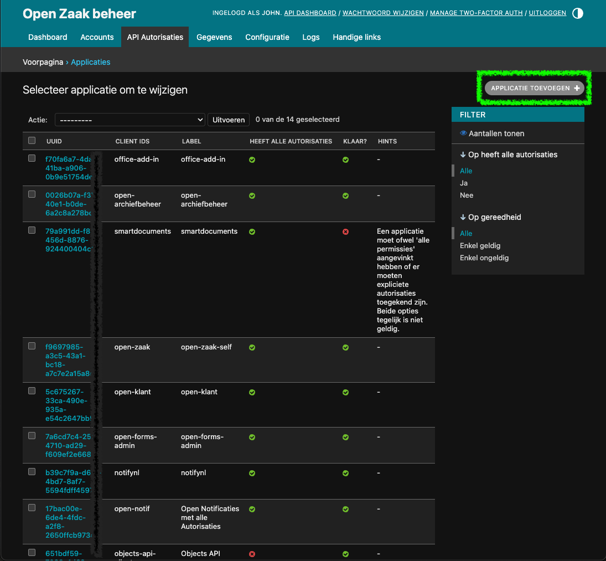
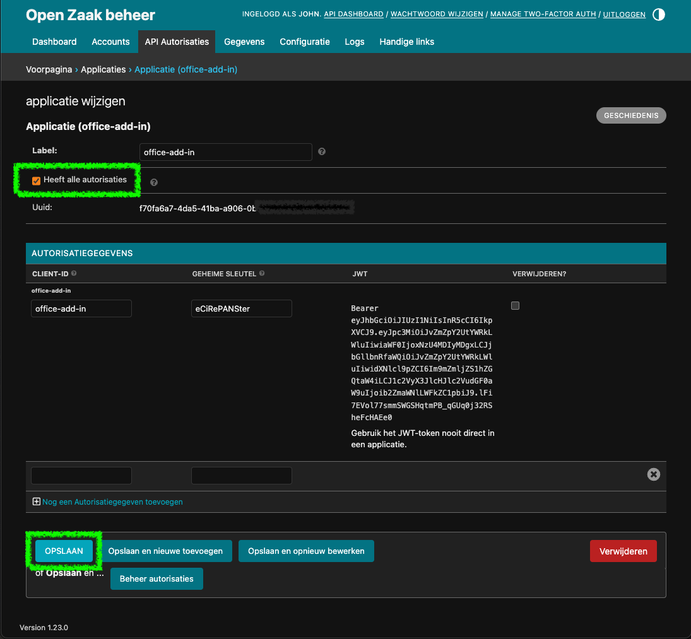

# Azure Registration Manual ZGW Office Add-In

## Introduction
This user guide is intended for the administrators of the Microsoft Add-In. This guide will describe how the add-in can be registered to OpenZaak and can communicate with it.

## Information about registering
The add-in must be registered in OpenZaak in order to communicate with it. This is done through a Secret Key that is passed through a JWT

## Registering the Add-in
To register the add-in log into OpenZaak and navigate to Applications. From there click on Applicatie Toevoegen

Fill the Label & Client-ID with "office-add-in". For the field Geheime Sleutel fill in the secret key from OpenZaak.

Click Opslaan 