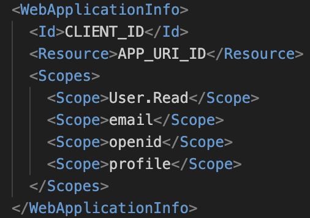

# Azure Registration Manual ZGW Office Add-In

## Introduction
This user guide is intended for the administrators/users of the microsoft Add-In. This guide will describe how the manifest files can be retrieved and configured to load in the office-add-in.  
There are two manifest variants — one for Outlook (mail add-in) and one for other Office hosts (Word, Excel, PowerPoint).  
Before following this manual make sure that you have [setup the azure registration](./azure-setup-manual.md) first

## Information about the manifest files
The manifest files serve as a guide for Outlook and other Office applications on how to install and display the add-in. It contains essential information such as the add-in’s title, description, permissions, and the web location where its content is hosted. In this way, the manifest ensures that the add-in is correctly recognized and made available to users within Outlook.

## Retrieve the manifest files
Follow the following steps:
1. For Word/Excel/PowerPoint: go to `https://ontw-office-addin.dimpact.info.nl/manifest-office.xml`
2. For Outlook: go to `https://ontw-office-addin.dimpact.info.nl/manifest-outlook.xml`
3. Copy the content of the desired manifest URL and paste it into a new text file.
4. Locate the `<WebApplicationInfo>` section in the text file — these values need to be updated in the next step.
5. Save the file using the same name as the variant (for example, `manifest-office.xml` or `manifest-outlook.xml`).

## Update the <WebApplicationInfo> values
The `<WebApplicationInfo>` section in the manifest connects the add-in to the correct Azure Active Directory application. You need to replace the placeholder values with the correct information from the registered app in Azure.
Inside the `<WebApplicationInfo>` place the following values

Replace the `CLIENT_ID` and `APP_URI_ID` with the correct values from Azure  

## Loading the add-in into Office
To load the add-in into office select Add-ins

From here select **Advanced → Upload My Add-In → Browse** to your saved manifest and upload it:
- For Word/Excel/PowerPoint: upload `manifest-office.xml`
- For Outlook: upload `manifest-outlook.xml`

The add-ins are now available for use. Follow the [user manual](./user-manual.md) for detailed instructions.