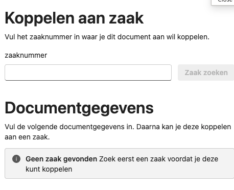
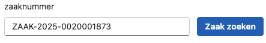
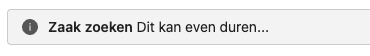
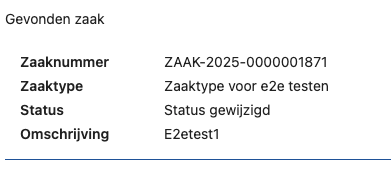
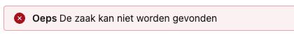
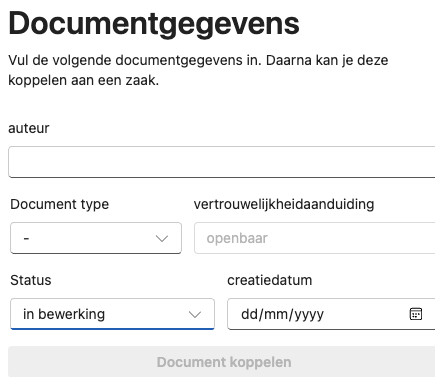

# Gebruikershandleiding ZGW Office Add-In
| versie | datum      | wijziging                                                      |
|--------|------------|----------------------------------------------------------------|
| 0.1    | 2025-07-04 | Opzet van deze gebruikershandleiding in de context van MS Word |

## Inleiding
Deze gebruikershandleiding is bedoeld voor medewerkers van gemeenten die de ZGW Office Add-In gebruiken. De add-in is 
een hulpmiddel dat de integratie van Microsoft Office applicaties met een zaaksysteem gebaseerd op de ZGW APIs, zoals 
Open Zaak, mogelijk maakt.

De uitgangssituatie waar deze handleiding op is gebaseerd, is dat de medewerker werkt met Microsoft 365 Office 
applicaties en dat de ZGW Office Add-In is geïnstalleerd en geconfigureerd door de gemeente.

## Gebruik van de ZGW Office Add-In
De ZGW Office Add-In is ontworpen om de interactie tussen Microsoft Word en een zaaksysteem te vergemakkelijken. Het is
zowel mogelijk om deze add-in te gebruiken in de desktopversie en de webversie van de Microsoft Office suite. De werking 
van de add-in is in beide versies gelijk, maar de interface kan iets verschillen.

### Open Add-in
De ZGW Office Add-In kan worden geopend vanuit de Microsoft Word applicatie. Dit kan gedaan worden door in de werkbalk
de optie "Dimpact Office" te selecteren. Houd er rekening mee dat de naam en de locatie van de add-in kan verschillen, 
afhankelijk van de configuratie bij uw gemeente.

De add-in opent in een zijpaneel aan de rechterkant van het scherm, dat ziet er zo uit:

### Zoek een zaak
Het zoekveld bovenaan het zijpaneel kan worden gebruikt om te zoeken naar een zaak. Vul een zaaknummer in het veld en 
druk op de "Zaak zoeken" knop of Enter op het toetsenbord.

De add-in zal dan de zaak ophalen uit het zaaksysteem en de details van de zaak tonen onder het zoekveld.

Als de zaak niet gevonden kan worden, zal er een foutmelding worden getoond. Controleer of het zaaknummer correct is en 
probeer het opnieuw.

### Documentgegevens invullen
Wanneer een zaak is gevonden, zullen de documentgegevens ingevuld moeten worden om dit document correct aan de zaak te 
kunnen koppelen.

De volgende gegevens moeten worden ingevuld:
- **auteur**: De naam van de auteur van het document.
- **type**: Het type document dat wordt aangemaakt. Dit is een keuzelijst die gevuld is met de beschikbare 
  documenttypen uit het zaaksysteem afhankelijk van het zaaktype.
- **vertrouwelijkheidaanduiding**: De vertrouwelijkheid van het document. Dit is gekoppeld aan het documenttype en kan
  niet worden gewijzigd.
- **Status**: De status van het document. Dit is een keuzelijst die gevuld is met de beschikbare document statussen.
- **Creatiedatum**: De datum waarop het document is aangemaakt.

### Document koppelen
Nadat de documentgegevens zijn ingevuld, kan het document worden gekoppeld aan de zaak. Dit kan gedaan worden door de 
"Document koppelen" knop te selecteren.

Het document wordt dan opgeslagen in het zaaksysteem en gekoppeld aan de zaak. Hiermee is de Add-In klaar en zal het 
vragen of er een volgend document gekoppeld moet worden of dat de add-in gesloten moet worden.
